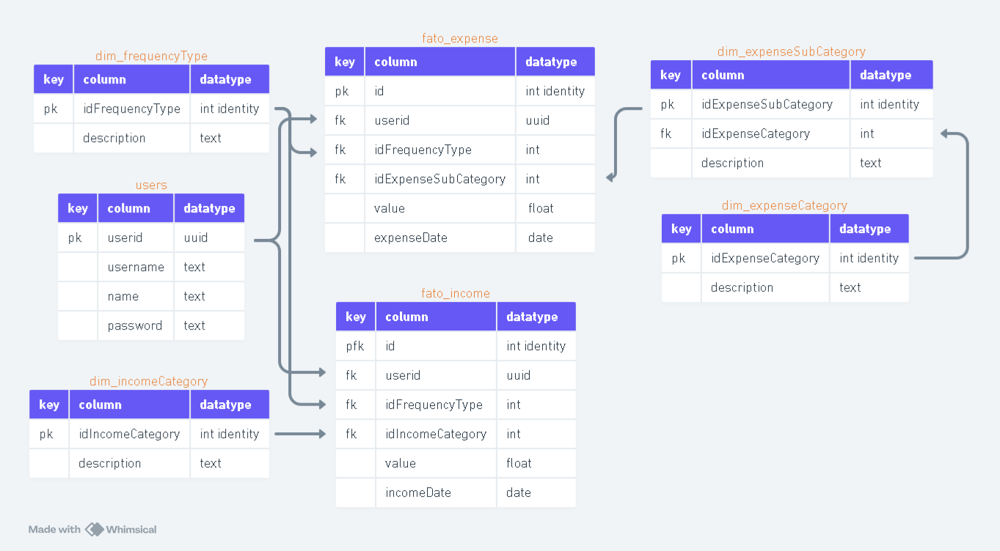
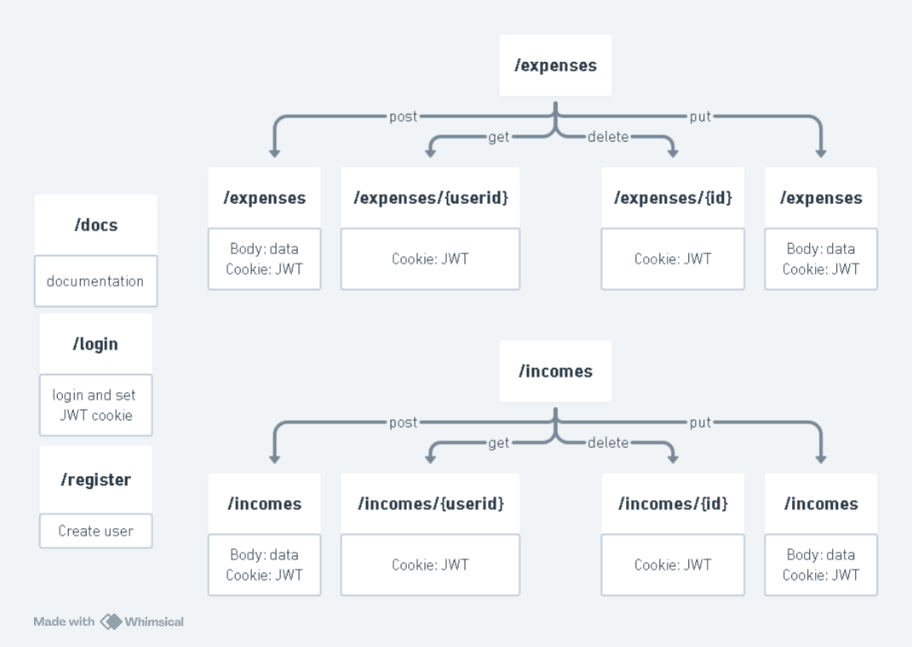

# API para Banco de Dados de Finanças
Este projeto consiste em um API (backend) para operações CRUD (Create, Read, Updatde and Delete) num banco de dados para registro de despesas e receitas, a fim de ter melhor controle, noção e análise dos próprios gastos. 
A ideia veio de quando eu estava participando de um curso de finanças e uma das primeiras instruções foi registrar despesas e receitas, não me senti muito satisfeito com os apps que eu ia encontrando para isso então decidi fazer o meu próprio. 
Aprendi tecnologias e técnicas novas, é um grande projeto de estudo e o próximo passo é aprender e fazer o frontend 😁.

## Tecnologias
* API: FastAPI (Python Framework);
* Security: Hash password "bcrypt" e JWT (Jason Web Token);
* Database: PostgreSQL;
* Database connection: SQLAlchemy (Python Framework);
* Environment: Docker Containers (Dockerfile e docker-compose);
* Tests: Pytest (Python Framework);
* Tests automation: Github Actions.

## Ambiente de execução
O [Dockerfile](./Dockerfile) cria uma imagem com o ambiente configurado instalando as dependências necessárias para conexão com o banco de dados, Python e as dependências do Python. 
O [docker compose](./docker-compose.yml) cria e executa os containers do banco de dados, da aplicação e (caso seja chamado o profile pgadmin) o pgadmin4. A configuração foi feita de forma que o app só seja executado caso o banco de dados estaja funcionando bem (saudável) e ambos os containers serão sempre reiniciados quando o computador ligar, mantendo tando o banco de dados quanto a aplicação sempre rodando localmente. 
Para manter os dados do banco de dados foi configurado um volume persistente e a pasta desse volume está sincronizada com o meu Google Drive, assim os dados estão sempre salvos na nuvem.

## Modelo banco de dados
O modelo do banco de dados ficou apenas tabelas para categorização dos tipos de despesas e receitas, o registro dos mesmos e a tabela de usuário. 

## Modelo API
O modelo da API funciona com autenticação de usuário através de JWT armazenado no cookie do cliente. Esse JWT é criado e salvo como cookie após realizar o logion, contém informação do uuid do usuário e expira em 2 dias. Caso tenha inatividade do usuário de 2 dias será solicitado novamente o login. 
O requerimento de `get` sempre retornará todos as despesas ou receitas do usuário.
